# Home Work n◦2: Polynomial Regression, Logistic Regression, and Perceptron

## Problem 1: Regression with polynomial fitting

### Initializing requiered libraries for all solutions

    import numpy as np
    import pandas as pd
    import pandas.tools.rplot as rplot
    import pylab as pl
    import matplotlib as mpl
    import matplotlib.pyplot as plt

### Initialize iPython hooks to be able to embed plots inline in the document

    %matplotlib inline 
    pd.set_option('display.notebook_repr_html', False)
    pd.set_option('display.max_columns', 20)
    pd.set_option('display.max_rows', 25)

#### Get Data, Define polynomial design matirx, plot the regression and define the cost function

    #Load data
    getData = np.asmatrix(np.loadtxt('/Users/mayank/Dropbox/Columbia University/Machine Learning/Lecture Notes/hw_2/girls_2_20_train.csv', 
            dtype='float', 
            delimiter=',',  
            usecols=(0,1), 
            unpack=True, 
            ndmin=0))
    
    x = getData[0, :] #this is the age and also the featre vector in this case
    y = getData[1, :] #this is the height
    m = y.size # this is the number of examples
    
    y = y.T #creating a vector matrix
    x = x.T #creating a vector matrix
    
    #creating design metrix to enable 
    #intercept
    x0 = np.power(x,0)
    
    #of order 1
    x1 = x
    z1 = np.concatenate((x0,x1),1)
    beta1 = ((z1.T*z1).I)*(z1.T*y)
    predictedValue1 = np.dot(z1, beta1)
    
    #of order 2
    x2 = np.power(x,2)
    z2 = np.concatenate((x0,x1,x2),1)
    beta2 = ((z2.T*z2).I)*(z2.T*y)
    predictedValue2 = np.dot(z2, beta2)
    
    #of order 3
    x3 = np.power(x,3)
    z3 = np.concatenate((x0,x1,x2,x3),1)
    beta3 = ((z3.T*z3).I)*(z3.T*y)
    predictedValue3 = np.dot(z3, beta3)
    
    #of order 4
    x4 = np.power(x,4)
    z4 = np.concatenate((x0,x1,x2,x3,x4),1)
    beta4 = ((z4.T*z4).I)*(z4.T*y)
    predictedValue4 = np.dot(z4, beta4)
    
    #of order 5
    x5 = np.power(x,5)
    z5 = np.concatenate((x0,x1,x2,x3,x4,x5),1)
    beta5 = ((z5.T*z5).I)*(z5.T*y)
    predictedValue5 = np.dot(z5, beta5)
    
    #Plot the regression 
    age = np.array(x)
    height = np.array(y)
    Y0 = np.array(x0)
    Y1 = np.array(predictedValue1)
    Y2 = np.array(predictedValue2)
    Y3 = np.array(predictedValue3)
    Y4 = np.array(predictedValue4)
    Y5 = np.array(predictedValue5)
    
    plt.figure(1, figsize=(16, 9))
    plt.clf()
    plt.plot(age, height, 'ro')
    #plt.plot(age, Y0, '-', label="d0")
    plt.plot(age, Y1, 'b--', label="d1")
    plt.plot(age, Y2, 'g--', label="d2")
    plt.plot(age, Y3, 'r-', label="Best Fit - d3")
    plt.plot(age, Y4, 'y--', label="d4")
    plt.plot(age, Y5, 'k--', label="d5")
    plt.legend(loc='best')
    plt.title('Age and Stature')
    plt.xlabel('Age in Years')
    plt.ylabel('Height')
    plt.show()
    
    
    def getCost(z, y, beta):
        #calculate the cost of a particular choice of beta
        predictedValue = np.dot(z, beta)
        #calculate squared error
        sqErrors = np.power((predictedValue - y),2)
        #calculate cost
        J = (1.0 / (2 * m)) * sqErrors.sum() 
        return J
    
    J1train = getCost(z1, y, beta1)
    J2train = getCost(z2, y, beta2)
    J3train = getCost(z3, y, beta3)
    J4train = getCost(z4, y, beta4)
    J5train = getCost(z5, y, beta5)
    print J1train
    print J2train
    print J3train
    print J4train
    print J5train

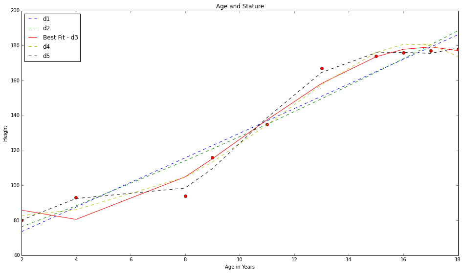

    51.0500560088
    49.6515074062
    20.0464096622
    16.061916226
    4.37596745653

####The best fit is for d=3

    # validate model against girls_2_20_validation
    
    #Load data
    getData = np.asmatrix(np.loadtxt('/Users/mayank/Dropbox/Columbia University/Machine Learning/Lecture Notes/hw_2/girls_2_20_validation.csv', 
            dtype='float', 
            delimiter=',',  
            usecols=(0,1), 
            unpack=True, 
            ndmin=0))
    
    x = getData[0, :] #this is the age and also the featre vector in this case
    y = getData[1, :] #this is the height
    m = y.size # this is the number of examples
    
    y = y.T #creating a vector matrix
    x = x.T #creating a vector matrix
    
    #creating design metrix to enable 
    
    #intercept
    x0 = np.power(x,0)
    
    #of order 1
    x1 = x
    z1 = np.concatenate((x0,x1),1)
    beta1 = ((z1.T*z1).I)*(z1.T*y)
    predictedValue1 = np.dot(z1, beta1)
    
    #of order 2
    x2 = np.power(x,2)
    z2 = np.concatenate((x0,x1,x2),1)
    beta2 = ((z2.T*z2).I)*(z2.T*y)
    predictedValue2 = np.dot(z2, beta2)
    
    #of order 3
    x3 = np.power(x,3)
    z3 = np.concatenate((x0,x1,x2,x3),1)
    beta3 = ((z3.T*z3).I)*(z3.T*y)
    predictedValue3 = np.dot(z3, beta3)
    
    #of order 4
    x4 = np.power(x,4)
    z4 = np.concatenate((x0,x1,x2,x3,x4),1)
    beta4 = ((z4.T*z4).I)*(z4.T*y)
    predictedValue4 = np.dot(z4, beta4)
    
    #of order 5
    x5 = np.power(x,5)
    z5 = np.concatenate((x0,x1,x2,x3,x4,x5),1)
    beta5 = ((z5.T*z5).I)*(z5.T*y)
    predictedValue5 = np.dot(z5, beta5)
    
    #Plot the regression 
    age = np.array(x)
    height = np.array(y)
    Y0 = np.array(x0)
    Y1 = np.array(predictedValue1)
    Y2 = np.array(predictedValue2)
    Y3 = np.array(predictedValue3)
    Y4 = np.array(predictedValue4)
    Y5 = np.array(predictedValue5)
    
    plt.figure(1, figsize=(16, 9))
    plt.clf()
    plt.plot(age, height, 'ro')
    #plt.plot(age, Y0, '-', label="d0")
    plt.plot(age, Y1, 'b--', label="d1")
    plt.plot(age, Y2, 'g--', label="d2")
    plt.plot(age, Y3, 'r-', label="Best Fit - d3")
    plt.plot(age, Y4, 'y--', label="d4")
    plt.plot(age, Y5, 'k--', label="d5")
    plt.legend(loc='best')
    plt.title('Age and Stature')
    plt.xlabel('Age in Years')
    plt.ylabel('Height')
    plt.show()
    
    def getCost(z, y, beta):
        #calculate the cost of a particular choice of beta
        predictedValue = np.dot(z, beta)
        #print predictedValue
        #print y
        #print y.shape
        #print predictedValue.shape
        #calculate squared error
        sqErrors = np.power((predictedValue - y),2)
        #calculate cost
        J = (1.0 / (2 * m)) * sqErrors.sum()
    #print J   
        return J
    
    J1valid = getCost(z1, y, beta1)
    J2valid = getCost(z2, y, beta2)
    J3valid = getCost(z3, y, beta3)
    J4valid = getCost(z4, y, beta4)
    J5valid = getCost(z5, y, beta5)
    
    
    #Plot training and validation errors against dimensions
    TrainingError = [J1train, J2train, J3train, J4train, J5train]
    ValidationError = [J1valid, J2valid, J3valid, J4valid, J5valid]
    Dimension = [1,2,3,4,5]
    
    plt.figure(1, figsize=(16, 9))
    plt.clf()
    plt.plot(Dimension, TrainingError, 'r-', label="Training Error")
    plt.plot(Dimension, ValidationError, 'b-', label="Validation Error")
    plt.legend(loc='best')
    plt.title('Estimation error by degree of Polynomial')
    plt.xlabel('degree')
    plt.ylabel('Error')
    plt.show()

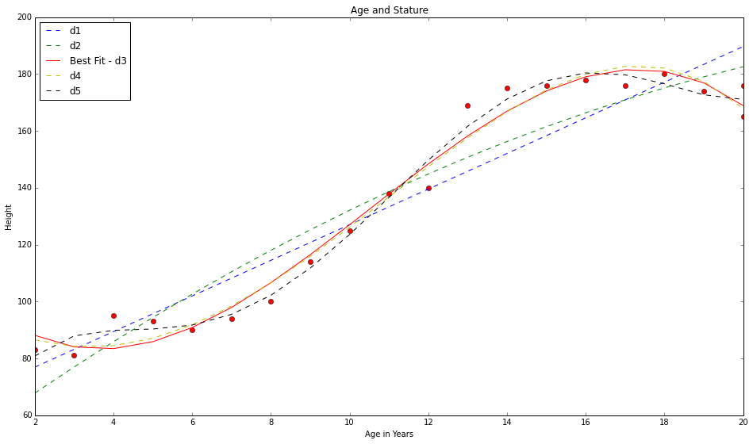

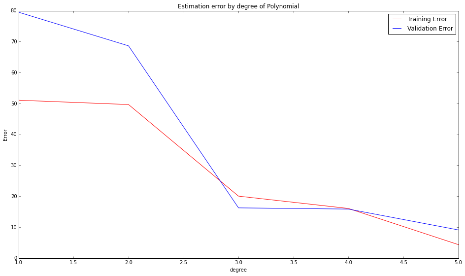

####As the validation error curve is below the test error curve for d3 and d4,
either of them can be used as a model.  However, d3 is the better of the two as
it reduces over fitting.

## Problem 2: Logistic Regression on the iris dataset Download the iris dataset from the repository. Read the description of the data.

The Iris dataset contains 50 examples each for 3 class of the Iris plant.
The features are:

1. sepal length in cm
2. sepal width in cm
3. petal length in cm
4. petal width in cm

The label/class are:

1.  Iris Setosa
2.  Iris Versicolour
3. Iris Virginica

### 2.1a Extract Data

    #set data source path
    path = '/Users/mayank/Dropbox/Columbia University/Machine Learning/Lecture Notes/hw_2/iris_data.csv'
    #set column names as the data doesn't have headers
    headers = ['sLength', 'sWidth', 'pLength', 'pWidth', 'cLabel']  
    #get the data, specify that there are no headers as the default will read first row as headers
    getData = pd.read_csv(path, header=None, names=headers)

    #confirm data extration
    getData.head()

       sLength  sWidth  pLength  pWidth       cLabel
    0      5.1     3.5      1.4     0.2  Iris-setosa
    1      4.9     3.0      1.4     0.2  Iris-setosa
    2      4.7     3.2      1.3     0.2  Iris-setosa
    3      4.6     3.1      1.5     0.2  Iris-setosa
    4      5.0     3.6      1.4     0.2  Iris-setosa
    
    [5 rows x 5 columns]

### Explore the dataset - Understand data statistics

    getData.groupby("cLabel").describe()

                             sLength     sWidth    pLength     pWidth
    cLabel                                                           
    Iris-setosa     count  50.000000  50.000000  50.000000  50.000000
                    mean    5.006000   3.418000   1.464000   0.244000
                    std     0.352490   0.381024   0.173511   0.107210
                    min     4.300000   2.300000   1.000000   0.100000
                    25%     4.800000   3.125000   1.400000   0.200000
                    50%     5.000000   3.400000   1.500000   0.200000
                    75%     5.200000   3.675000   1.575000   0.300000
                    max     5.800000   4.400000   1.900000   0.600000
    Iris-versicolor count  50.000000  50.000000  50.000000  50.000000
                    mean    5.936000   2.770000   4.260000   1.326000
                    std     0.516171   0.313798   0.469911   0.197753
                    min     4.900000   2.000000   3.000000   1.000000
                    25%     5.600000   2.525000   4.000000   1.200000
                    50%     5.900000   2.800000   4.350000   1.300000
                    75%     6.300000   3.000000   4.600000   1.500000
                    max     7.000000   3.400000   5.100000   1.800000
    Iris-virginica  count  50.000000  50.000000  50.000000  50.000000
                    mean    6.588000   2.974000   5.552000   2.026000
                    std     0.635880   0.322497   0.551895   0.274650
                    min     4.900000   2.200000   4.500000   1.400000
                    25%     6.225000   2.800000   5.100000   1.800000
                    50%     6.500000   3.000000   5.550000   2.000000
                    75%     6.900000   3.175000   5.875000   2.300000
                    max     7.900000   3.800000   6.900000   2.500000
    
    [24 rows x 4 columns]

    #visually explore the datafrom pandas.tools.plotting import scatter_matrix
    
    pd.scatter_matrix(getData, alpha=0.2, figsize=(8, 8), diagonal='kde')

    array([[<matplotlib.axes.AxesSubplot object at 0x1118c0a50>,
            <matplotlib.axes.AxesSubplot object at 0x111e58dd0>,
            <matplotlib.axes.AxesSubplot object at 0x111e55e10>,
            <matplotlib.axes.AxesSubplot object at 0x111df84d0>],
           [<matplotlib.axes.AxesSubplot object at 0x111e06590>,
            <matplotlib.axes.AxesSubplot object at 0x111e3b1d0>,
            <matplotlib.axes.AxesSubplot object at 0x111e87210>,
            <matplotlib.axes.AxesSubplot object at 0x103541690>],
           [<matplotlib.axes.AxesSubplot object at 0x111e3e050>,
            <matplotlib.axes.AxesSubplot object at 0x1035837d0>,
            <matplotlib.axes.AxesSubplot object at 0x1035a6d10>,
            <matplotlib.axes.AxesSubplot object at 0x10578b790>],
           [<matplotlib.axes.AxesSubplot object at 0x1057b5210>,
            <matplotlib.axes.AxesSubplot object at 0x105799850>,
            <matplotlib.axes.AxesSubplot object at 0x1057f5710>,
            <matplotlib.axes.AxesSubplot object at 0x1129149d0>]], dtype=object)

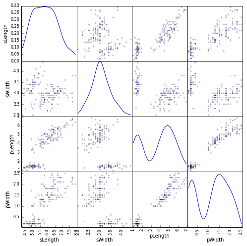

### 2.1b Enrich Data - Append new column to translate string to numerical values

    #Insert a column 'newLabel' to traslate string values in 'cLabel' to numberical vlaues
    #Initialize the column with numberical value 0
    #getData.insert(5, 'newLabel', 0)
    
    #Insert values in newLabel based ont he value in cLabel
    getData['newLabel'] = getData.apply(lambda row: (1
                                                   if row['cLabel']=='Iris-setosa'
                                                   else 2
                                                      if row['cLabel']=='Iris-versicolor'
                                                    else 3), axis=1)
    getData.head()

       sLength  sWidth  pLength  pWidth       cLabel  newLabel
    0      5.1     3.5      1.4     0.2  Iris-setosa         1
    1      4.9     3.0      1.4     0.2  Iris-setosa         1
    2      4.7     3.2      1.3     0.2  Iris-setosa         1
    3      4.6     3.1      1.5     0.2  Iris-setosa         1
    4      5.0     3.6      1.4     0.2  Iris-setosa         1
    
    [5 rows x 6 columns]

### 2.2 Plot the distribution of the data. For each pair of features, create a scatter plot of the 3 species of Iris

    #For Sepal Length and Sepal Width
    setosaSeries = getData[getData.newLabel == 1]
    versicolorSeries = getData[getData.newLabel == 2]
    verginicaSeries = getData[getData.newLabel == 3]
    plt.figure(1, figsize=(16, 9))
    plt.scatter(setosaSeries.sLength , setosaSeries.sWidth, s=35, marker='o', color='green', label='Iris-setosa')
    plt.scatter(versicolorSeries.sLength , versicolorSeries.sWidth, s=35, marker='o', color ='red', label= 'Iris-versicolor')
    plt.scatter(verginicaSeries.sLength , verginicaSeries.sWidth, s=35, marker='o', color='blue', label='Iris-virginica')
    plt.legend(bbox_to_anchor=(1.05, 1), loc=2, borderaxespad=0.)
    plt.title('Distribution for Sepal Length and Width')
    plt.xlabel('Sepal Length')
    plt.ylabel('Sepal Width')

    <matplotlib.text.Text at 0x111e0d050>

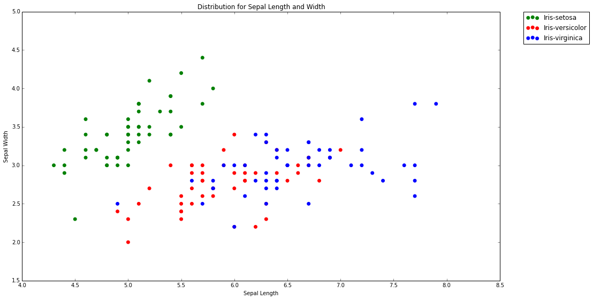

    #For Petal Length and Petal Width
    setosaSeries = getData[getData.newLabel == 1]
    versicolorSeries = getData[getData.newLabel == 2]
    verginicaSeries = getData[getData.newLabel == 3]
    plt.figure(1, figsize=(16, 9))
    plt.scatter(setosaSeries.pLength , setosaSeries.pWidth, s=35, marker='o', color='green', label='Iris-setosa')
    plt.scatter(versicolorSeries.pLength , versicolorSeries.pWidth, s=35, marker='o', color ='red', label= 'Iris-versicolor')
    plt.scatter(verginicaSeries.pLength , verginicaSeries.pWidth, s=35, marker='o', color='blue', label='Iris-virginica')
    plt.legend(bbox_to_anchor=(1.05, 1), loc=2, borderaxespad=0.)
    plt.title('Distribution for Petal Length and Width')
    plt.xlabel('Petal Length')
    plt.ylabel('Petal Width')

    <matplotlib.text.Text at 0x1129f1750>

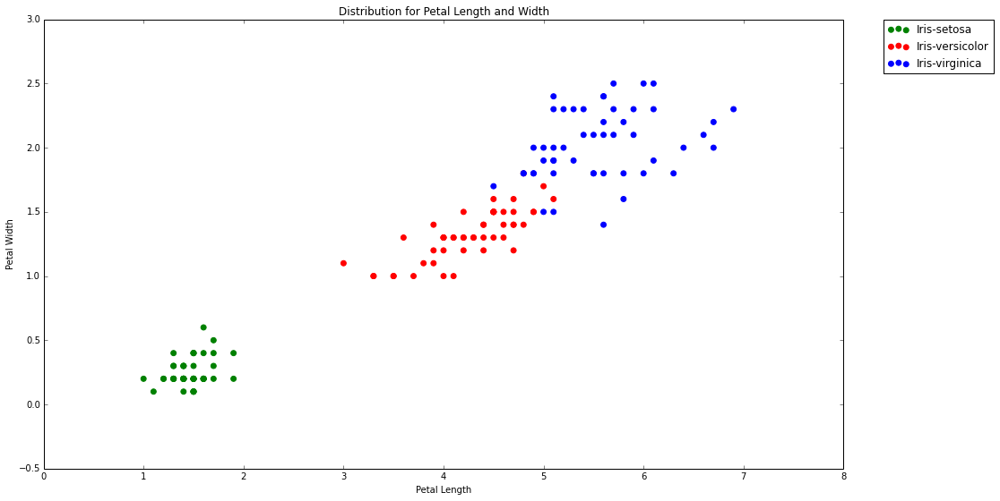

    #For Sepal Length and Petal Width
    setosaSeries = getData[getData.newLabel == 1]
    versicolorSeries = getData[getData.newLabel == 2]
    verginicaSeries = getData[getData.newLabel == 3]
    plt.figure(1, figsize=(16, 9))
    plt.scatter(setosaSeries.sLength , setosaSeries.pWidth, s=35, marker='o', color='green', label='Iris-setosa')
    plt.scatter(versicolorSeries.sLength , versicolorSeries.pWidth, s=35, marker='o', color ='red', label= 'Iris-versicolor')
    plt.scatter(verginicaSeries.sLength , verginicaSeries.pWidth, s=35, marker='o', color='blue', label='Iris-virginica')
    plt.legend(bbox_to_anchor=(1.05, 1), loc=2, borderaxespad=0.)
    plt.title('Distribution for Sepal Length and Petal Width')
    plt.xlabel('Sepal Length')
    plt.ylabel('Petal Width')

    <matplotlib.text.Text at 0x11381f210>

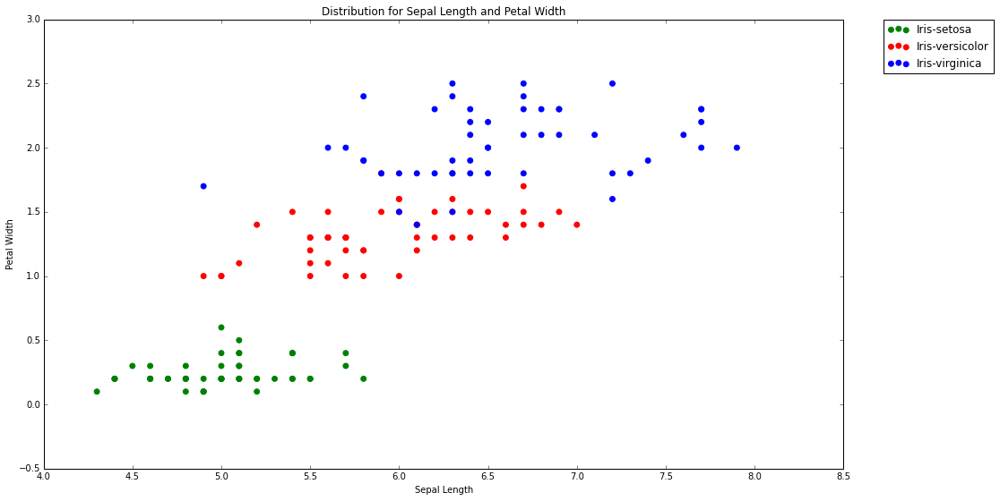

    #For Sepal Length and Petal Length
    setosaSeries = getData[getData.newLabel == 1]
    versicolorSeries = getData[getData.newLabel == 2]
    verginicaSeries = getData[getData.newLabel == 3]
    plt.figure(1, figsize=(16, 9))
    plt.scatter(setosaSeries.sLength , setosaSeries.pLength, s=35, marker='o', color='green', label='Iris-setosa')
    plt.scatter(versicolorSeries.sLength , versicolorSeries.pLength, s=35, marker='o', color ='red', label= 'Iris-versicolor')
    plt.scatter(verginicaSeries.sLength , verginicaSeries.pLength, s=35, marker='o', color='blue', label='Iris-virginica')
    plt.legend(bbox_to_anchor=(1.05, 1), loc=2, borderaxespad=0.)
    plt.title('Distribution for Sepal Length and Petal Length')
    plt.xlabel('Sepal Length')
    plt.ylabel('Petal Length')

    <matplotlib.text.Text at 0x11382f8d0>

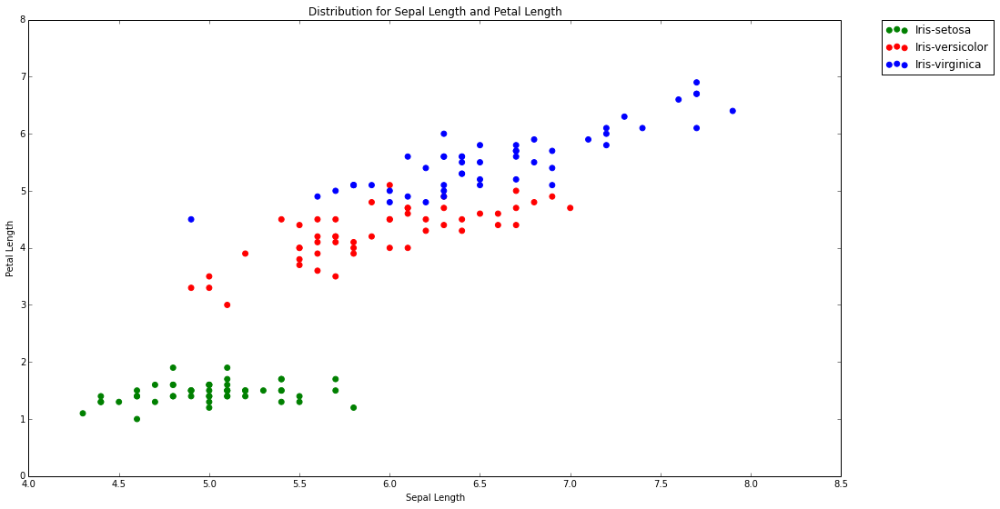

    #For Sepal Width and Petal Width
    setosaSeries = getData[getData.newLabel == 1]
    versicolorSeries = getData[getData.newLabel == 2]
    verginicaSeries = getData[getData.newLabel == 3]
    plt.figure(1, figsize=(16, 9))
    plt.scatter(setosaSeries.sWidth , setosaSeries.pWidth, s=35, marker='o', color='green', label='Iris-setosa')
    plt.scatter(versicolorSeries.sWidth , versicolorSeries.pWidth, s=35, marker='o', color ='red', label= 'Iris-versicolor')
    plt.scatter(verginicaSeries.sWidth , verginicaSeries.pWidth, s=35, marker='o', color='blue', label='Iris-virginica')
    plt.legend(bbox_to_anchor=(1.05, 1), loc=2, borderaxespad=0.)
    plt.title('Distribution for Sepal Width and Petal Width')
    plt.xlabel('Sepal Width')
    plt.ylabel('Petal Width')

    <matplotlib.text.Text at 0x113831bd0>

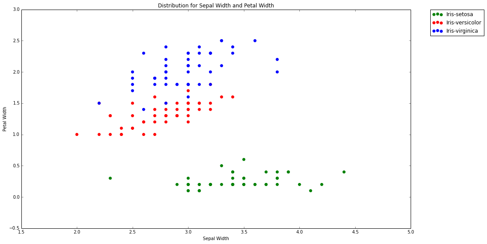

    #For Sepal Width and Petal Legth
    setosaSeries = getData[getData.newLabel == 1]
    versicolorSeries = getData[getData.newLabel == 2]
    verginicaSeries = getData[getData.newLabel == 3]
    plt.figure(1, figsize=(16, 9))
    plt.scatter(setosaSeries.sWidth , setosaSeries.pLength, s=35, marker='o', color='green', label='Iris-setosa')
    plt.scatter(versicolorSeries.sWidth , versicolorSeries.pLength, s=35, marker='o', color ='red', label= 'Iris-versicolor')
    plt.scatter(verginicaSeries.sWidth , verginicaSeries.pLength, s=35, marker='o', color='blue', label='Iris-virginica')
    plt.legend(bbox_to_anchor=(1.05, 1), loc=2, borderaxespad=0.)
    plt.title('Distribution for Sepal Width and Petal Length')
    plt.xlabel('Sepal Width')
    plt.ylabel('Petal Length')

    <matplotlib.text.Text at 0x114367910>

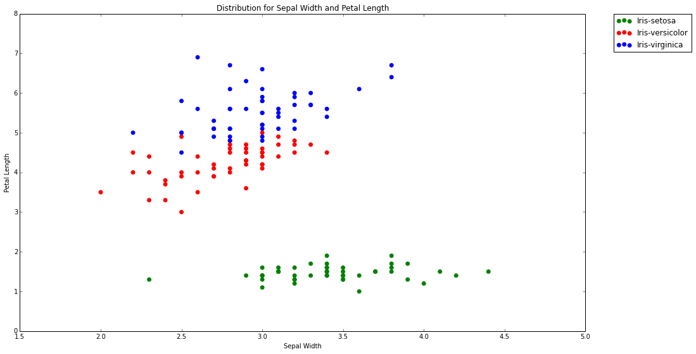

### 2.3 Decision boundaries overlayed on the scatter plot 

#### Based on the drawn decision boundaries on the scatter plot, the regularized logistic regression implemented in sklearn to classify Setosa from the rest of flowers does not make any error.   

    # import the first couple of feature
    X = getData[['sLength','sWidth']]

#### #Define a function based on the Logistic Regression code to loop through different label values

    #Reference SciKit-Learn documentation: http://scikit-learn.org/stable/auto_examples/linear_model/plot_iris_logistic.html
    
    #Define a function based on the Logistic Regression code to loop through different label values
    def logregLoopRegularized(Y):
        from sklearn import linear_model
        h = .02  # step size in the mesh
        logreg = linear_model.LogisticRegression(C=1e5)
        
        # Neighbours Classifier to fit the data.
        logreg.fit(X, Y)
        
        #Score 
        score = logreg.score(X, Y)
        
        print 'The score for this iteration is'
        print score	
    
        # Plot the decision boundary. Assign a color to each point in the mesh [x_min, m_max]x[y_min, y_max].
        x_min, x_max = X['sLength'].min() - .5, X['sLength'].max() + .5
        y_min, y_max = X['sWidth'].min() - .5, X['sWidth'].max() + .5
        xx, yy = np.meshgrid(np.arange(x_min, x_max, h), np.arange(y_min, y_max, h))
        
        #Predict
        Z = logreg.predict(np.c_[xx.ravel(), yy.ravel()])
        
        
        # Plot result
        Z = Z.reshape(xx.shape)
        pl.figure(1, figsize=(16, 9))
        pl.pcolormesh(xx, yy, Z, cmap=pl.cm.Paired)
        pl.xlim(xx.min(), xx.max())
        pl.ylim(yy.min(), yy.max())
        
        # Plot training points
        pl.scatter(X['sLength'], X['sWidth'], c=Y, edgecolors='k', cmap=pl.cm.Paired)
        pl.xlabel('Length')
        pl.ylabel('Width')

#### #Loop through label values and plot boundries dynamically changing the plot title

    #Loop through label values and plot boundries dynamically changing the plot title
    
    for i in range(1,4):
        Y = getData.newLabel==i
        logregLoopRegularized(Y)
            
        if i == 1:
            T='Setosa classification from the rest of flowers for C=1e5'
        elif i == 2:
            T='Versicolor classification from the rest of flowers for C=1e5'
        else:
            T='Verginica classification from the rest of flowers for C=1e5'
            
        pl.title(T)
    
        pl.xticks(())
        pl.yticks(())
        pl.show()
        
        i=i+1

    The score for this iteration is
    1.0

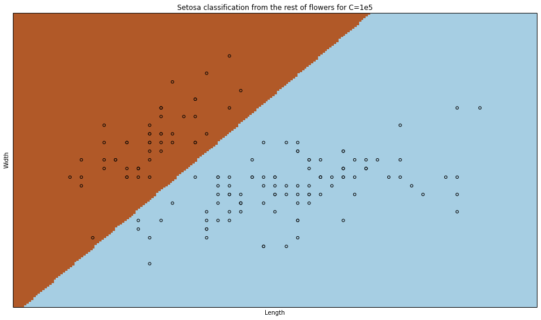

    The score for this iteration is
    0.713333333333

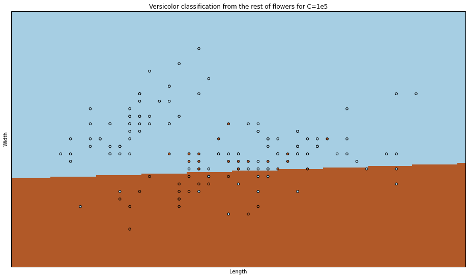

    The score for this iteration is
    0.806666666667

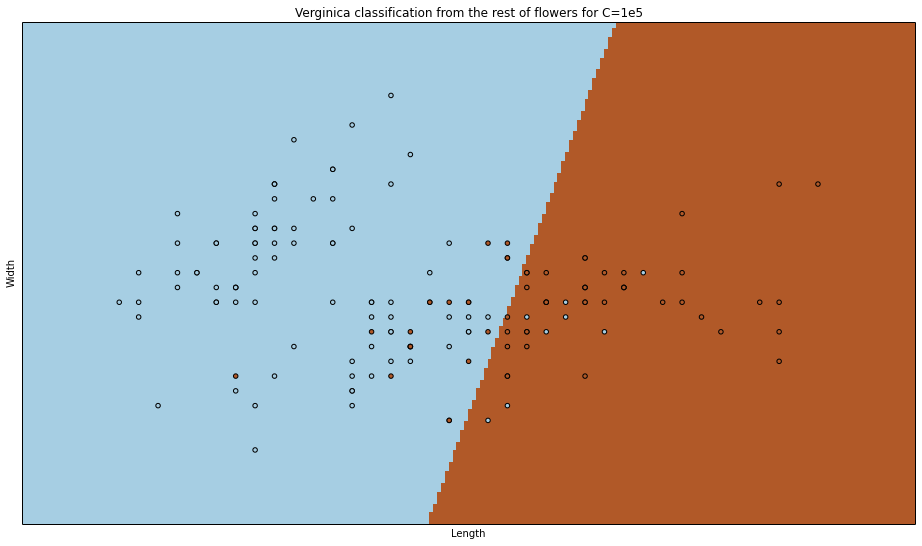

### 2.4 Infer errors made by this model for Virginica based on the decision boundries and scatter plot

#### Based on the drawn decision boundaries on the scatter plot, the logistic regression implemented in sklearn to classify Virginica the rest of flowers makes 31 (21+10) errors for C=1 as compared to 22 (14+8) errors for C=1e5. 

#### #Define a function based on the Logistic Regression code to loop through different label values

    #Reference SciKit-Learn documentation: http://scikit-learn.org/stable/auto_examples/linear_model/plot_iris_logistic.html
    
    #Define a function based on the Logistic Regression code to loop through different label values
    def logregLoop(Y):
        from sklearn import linear_model
        h = .02  # step size in the mesh
        
        #for C = 1
        logreg = linear_model.LogisticRegression(C=1)
        
        #Neighbours Classifier to fit the data.
        logreg.fit(X, Y)
            
        score = logreg.score(X, Y)
        
        print 'The score for this iteration is'
        print score	
        
        # Plot decision boundary. Assign a color to each point in the mesh [x_min, m_max]x[y_min, y_max].
        x_min, x_max = X['sLength'].min() - .5, X['sLength'].max() + .5
        y_min, y_max = X['sWidth'].min() - .5, X['sWidth'].max() + .5
        xx, yy = np.meshgrid(np.arange(x_min, x_max, h), np.arange(y_min, y_max, h))
        
        #Predict
        Z = logreg.predict(np.c_[xx.ravel(), yy.ravel()])
        
        #Plot results
        
        Z = Z.reshape(xx.shape)
        pl.figure(1, figsize=(16, 9))
        pl.pcolormesh(xx, yy, Z, cmap=pl.cm.Paired)
        pl.xlim(xx.min(), xx.max())
        pl.ylim(yy.min(), yy.max())
        
        # Plot training points
        pl.scatter(X['sLength'], X['sWidth'], c=Y, edgecolors='k', cmap=pl.cm.Paired)
        pl.xlabel('Length')
        pl.ylabel('Width')

#### 'Virginica classification from the rest of flowers for C=1'

    Y = getData.newLabel==3
    logregLoop(Y)
    pl.title('Virginica classification from the rest of flowers for C=1')
    pl.xticks(())
    pl.yticks(())
    pl.show()

    The score for this iteration is
    0.726666666667

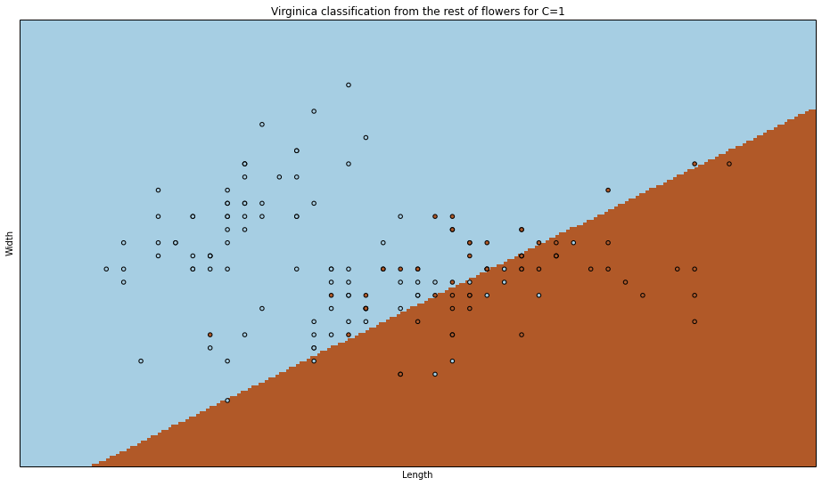

### 2.5 Infer errors made by a polynomial model for classfying Verginica based on the decision boundries and scatter plot

#### Define Regularized Polynomial Logistic Regression

    Y = getData.newLabel
    #Reference SciKit-Learn documentation: http://scikit-learn.org/stable/auto_examples/linear_model/plot_iris_logistic.html
    
    def logregLoopRegularizedPolynomial(Y, P):
        from sklearn import linear_model
        h = .02  # step size in the mesh
        
        newX = np.power(X, P)
        
        logreg = linear_model.LogisticRegression(C=1e5)
        
        # Neighbours Classifier and fit the data.
        logreg.fit(newX, Y)
            
        score = logreg.score(newX, Y)
        
        print 'The score for this iteration is'
        print score	
        
        
        # Plot the decision boundary. For that, we will assign a color to each
        # point in the mesh [x_min, m_max]x[y_min, y_max].
        x_min, x_max = newX['sLength'].min() - .5, newX['sLength'].max() + .5
        y_min, y_max = newX['sWidth'].min() - .5, newX['sWidth'].max() + .5
        xx, yy = np.meshgrid(np.arange(x_min, x_max, h), np.arange(y_min, y_max, h))
        Z = logreg.predict(np.c_[xx.ravel(), yy.ravel()])
        
        # Put the result into a color plot
        
        Z = Z.reshape(xx.shape)
        pl.figure(1, figsize=(16, 9))
        pl.pcolormesh(xx, yy, Z, cmap=pl.cm.Paired)
        
        # Plot also the training points
        pl.scatter(newX['sLength'], newX['sWidth'], c=Y, edgecolors='k', cmap=pl.cm.Paired)
        pl.xlabel('Length')
        pl.ylabel('Width')
        
        pl.title('Classification for all Classes')
        pl.xlim(xx.min(), xx.max())
        pl.ylim(yy.min(), yy.max())

    #Loop through power values 2 & 3 and plot boundries dynamically changing the plot title
    
    for i in range(2,4):
        Y = getData.newLabel==3
        P = i
        logregLoopRegularizedPolynomial(Y, P)
            
        if i == 2:
            T='Verginica classification from the rest of flowers when the features are raised to the power 2'
        else:
            T='Verginica classification from the rest of flowers when the features are raised to the power 3'
            
        pl.title(T)
    
        pl.xticks(())
        pl.yticks(())
        pl.show()
        
        i=i+1

    The score for this iteration is
    0.806666666667

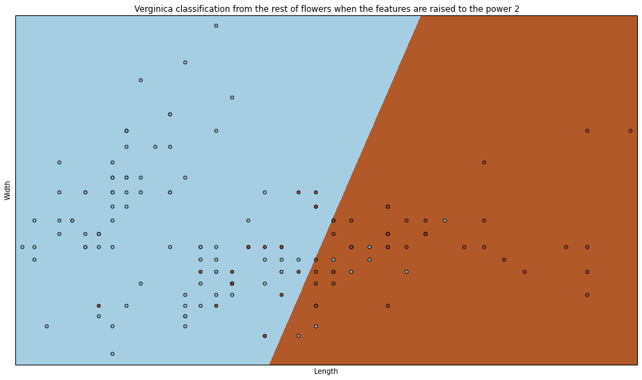

    The score for this iteration is
    0.8

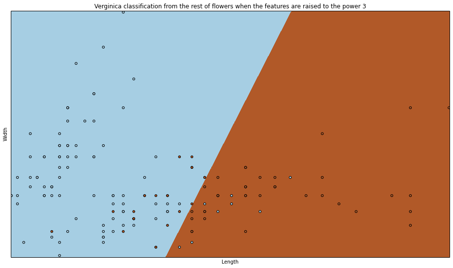

    #Loop through power values 4 &5 and plot boundries dynamically changing the plot title
    
    for i in range(4,6):
        Y = getData.newLabel==3
        P = i
        #logregLoopRegularizedPolynomial(Y, P)
        #CAUTION takes a very long time to run    
        if i == 4:
            T='Verginica classification from the rest of flowers when the features are raised to the power 4'
        else:
            T='Verginica classification from the rest of flowers when the features are raised to the power 5'
            
        pl.title(T)
    
        pl.xticks(())
        pl.yticks(())
        pl.show()
        
        i=i+1

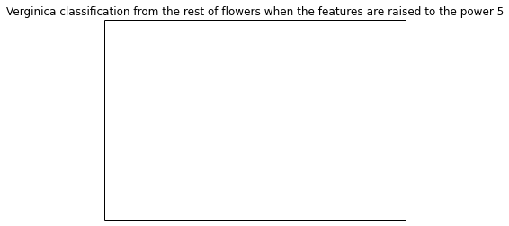

    #Loop through power value 6 and plot boundries dynamically changing the plot title
    
    
    Y = getData.newLabel==3
    P = i
    #logregLoopRegularizedPolynomial(Y, P)
    #Caution takes a very long time to run
    T='Verginica classification from the rest of flowers when the features are raised to the power 6'
        
    pl.title(T)
    pl.xticks(())
    pl.yticks(())
    pl.show()

## Problem 3:  Perceptron

### 3.1 A Perceptron Algorithm

    import numpy as np
    
    # map the LED outputs
    dataLED = np.array([[1,1,1,1,1,1,1,0], 
                    [1,0,1,1,0,0,0,0],
                    [1,1,1,0,1,1,0,1],
                    [1,1,1,1,1,0,0,1],
                    [1,0,0,1,0,0,1,1],
                    [1,1,0,1,1,0,1,1],
                    [1,0,0,1,1,1,1,1],
                    [1,1,1,1,0,0,0,0],
                    [1,1,1,1,1,1,1,1],
                    [1,1,1,1,1,0,1,1]])
    
    #setup the known classification for odd/even number.  
    expect = np.array([[-1],[1],[-1],[1],[-1],[1],[-1],[1], [-1],[1]])
    
    #initialize the weights
    W = np.array([[1],[1],[1],[1],[1],[1],[1],[1]])
    
    def train(data,weights):
        print('Incoming data ')
        print data
        
        dataSize= len(data)
        print('This is the number of rows ')
        print dataSize
        
        
        print('This is the size of the weights ')
       # print wSize
        
        for x in range(dataSize):
            print('LED row number is ')
            print(x)
            
            row = data[x]
            print('LED binary code is ')
            print row
            
            print('Confirm shape of incoming row')
            print row.shape
            
            print('Confirm shape of incoming weights ')
            print(W.shape)
            
            dotSUM = np.dot(row,W)
            print ('This is the sum after the dot product ')
            print dotSUM
            
            if dotSUM > 0:
                predicted = 1
            else:
                predicted = -1
            print ('The predicted value was ')
            print predicted
            
            expected = expect[x]
            print ('The expected value was ')
            print expected
            
            if expected*predicted < 0:
                #update weights
              
                print('Thia the array ')
                arrayRow = np.asarray(row)
                print arrayRow.shape
                wSize = weights.size
                for i in range (wSize):
                    print('This it the W coming in ')
                    print W[i]
                    W[i] += expected*arrayRow[i]
                    print ('This is the updated W ')
                    print W
        
        print ('This is the final weights ')
        newWeight = W
        print newWeight
        
        ###if newWeight == train(trainLED, newWeight):'''
               #print('Convergence reached ')
                             
    #train for LED data
    trainLED = dataLED
    train(trainLED,W)
        

    Incoming data 
    [[1 1 1 1 1 1 1 0]
     [1 0 1 1 0 0 0 0]
     [1 1 1 0 1 1 0 1]
     [1 1 1 1 1 0 0 1]
     [1 0 0 1 0 0 1 1]
     [1 1 0 1 1 0 1 1]
     [1 0 0 1 1 1 1 1]
     [1 1 1 1 0 0 0 0]
     [1 1 1 1 1 1 1 1]
     [1 1 1 1 1 0 1 1]]
    This is the number of rows 
    10
    This is the size of the weights 
    LED row number is 
    0
    LED binary code is 
    [1 1 1 1 1 1 1 0]
    Confirm shape of incoming row
    (8,)
    Confirm shape of incoming weights 
    (8, 1)
    This is the sum after the dot product 
    [7]
    The predicted value was 
    1
    The expected value was 
    [-1]
    Thia the array 
    (8,)
    This it the W coming in 
    [1]
    This is the updated W 
    [[0]
     [1]
     [1]
     [1]
     [1]
     [1]
     [1]
     [1]]
    This it the W coming in 
    [1]
    This is the updated W 
    [[0]
     [0]
     [1]
     [1]
     [1]
     [1]
     [1]
     [1]]
    This it the W coming in 
    [1]
    This is the updated W 
    [[0]
     [0]
     [0]
     [1]
     [1]
     [1]
     [1]
     [1]]
    This it the W coming in 
    [1]
    This is the updated W 
    [[0]
     [0]
     [0]
     [0]
     [1]
     [1]
     [1]
     [1]]
    This it the W coming in 
    [1]
    This is the updated W 
    [[0]
     [0]
     [0]
     [0]
     [0]
     [1]
     [1]
     [1]]
    This it the W coming in 
    [1]
    This is the updated W 
    [[0]
     [0]
     [0]
     [0]
     [0]
     [0]
     [1]
     [1]]
    This it the W coming in 
    [1]
    This is the updated W 
    [[0]
     [0]
     [0]
     [0]
     [0]
     [0]
     [0]
     [1]]
    This it the W coming in 
    [1]
    This is the updated W 
    [[0]
     [0]
     [0]
     [0]
     [0]
     [0]
     [0]
     [1]]
    LED row number is 
    1
    LED binary code is 
    [1 0 1 1 0 0 0 0]
    Confirm shape of incoming row
    (8,)
    Confirm shape of incoming weights 
    (8, 1)
    This is the sum after the dot product 
    [0]
    The predicted value was 
    -1
    The expected value was 
    [1]
    Thia the array 
    (8,)
    This it the W coming in 
    [0]
    This is the updated W 
    [[1]
     [0]
     [0]
     [0]
     [0]
     [0]
     [0]
     [1]]
    This it the W coming in 
    [0]
    This is the updated W 
    [[1]
     [0]
     [0]
     [0]
     [0]
     [0]
     [0]
     [1]]
    This it the W coming in 
    [0]
    This is the updated W 
    [[1]
     [0]
     [1]
     [0]
     [0]
     [0]
     [0]
     [1]]
    This it the W coming in 
    [0]
    This is the updated W 
    [[1]
     [0]
     [1]
     [1]
     [0]
     [0]
     [0]
     [1]]
    This it the W coming in 
    [0]
    This is the updated W 
    [[1]
     [0]
     [1]
     [1]
     [0]
     [0]
     [0]
     [1]]
    This it the W coming in 
    [0]
    This is the updated W 
    [[1]
     [0]
     [1]
     [1]
     [0]
     [0]
     [0]
     [1]]
    This it the W coming in 
    [0]
    This is the updated W 
    [[1]
     [0]
     [1]
     [1]
     [0]
     [0]
     [0]
     [1]]
    This it the W coming in 
    [1]
    This is the updated W 
    [[1]
     [0]
     [1]
     [1]
     [0]
     [0]
     [0]
     [1]]
    LED row number is 
    2
    LED binary code is 
    [1 1 1 0 1 1 0 1]
    Confirm shape of incoming row
    (8,)
    Confirm shape of incoming weights 
    (8, 1)
    This is the sum after the dot product 
    [3]
    The predicted value was 
    1
    The expected value was 
    [-1]
    Thia the array 
    (8,)
    This it the W coming in 
    [1]
    This is the updated W 
    [[0]
     [0]
     [1]
     [1]
     [0]
     [0]
     [0]
     [1]]
    This it the W coming in 
    [0]
    This is the updated W 
    [[ 0]
     [-1]
     [ 1]
     [ 1]
     [ 0]
     [ 0]
     [ 0]
     [ 1]]
    This it the W coming in 
    [1]
    This is the updated W 
    [[ 0]
     [-1]
     [ 0]
     [ 1]
     [ 0]
     [ 0]
     [ 0]
     [ 1]]
    This it the W coming in 
    [1]
    This is the updated W 
    [[ 0]
     [-1]
     [ 0]
     [ 1]
     [ 0]
     [ 0]
     [ 0]
     [ 1]]
    This it the W coming in 
    [0]
    This is the updated W 
    [[ 0]
     [-1]
     [ 0]
     [ 1]
     [-1]
     [ 0]
     [ 0]
     [ 1]]
    This it the W coming in 
    [0]
    This is the updated W 
    [[ 0]
     [-1]
     [ 0]
     [ 1]
     [-1]
     [-1]
     [ 0]
     [ 1]]
    This it the W coming in 
    [0]
    This is the updated W 
    [[ 0]
     [-1]
     [ 0]
     [ 1]
     [-1]
     [-1]
     [ 0]
     [ 1]]
    This it the W coming in 
    [1]
    This is the updated W 
    [[ 0]
     [-1]
     [ 0]
     [ 1]
     [-1]
     [-1]
     [ 0]
     [ 0]]
    LED row number is 
    3
    LED binary code is 
    [1 1 1 1 1 0 0 1]
    Confirm shape of incoming row
    (8,)
    Confirm shape of incoming weights 
    (8, 1)
    This is the sum after the dot product 
    [-1]
    The predicted value was 
    -1
    The expected value was 
    [1]
    Thia the array 
    (8,)
    This it the W coming in 
    [0]
    This is the updated W 
    [[ 1]
     [-1]
     [ 0]
     [ 1]
     [-1]
     [-1]
     [ 0]
     [ 0]]
    This it the W coming in 
    [-1]
    This is the updated W 
    [[ 1]
     [ 0]
     [ 0]
     [ 1]
     [-1]
     [-1]
     [ 0]
     [ 0]]
    This it the W coming in 
    [0]
    This is the updated W 
    [[ 1]
     [ 0]
     [ 1]
     [ 1]
     [-1]
     [-1]
     [ 0]
     [ 0]]
    This it the W coming in 
    [1]
    This is the updated W 
    [[ 1]
     [ 0]
     [ 1]
     [ 2]
     [-1]
     [-1]
     [ 0]
     [ 0]]
    This it the W coming in 
    [-1]
    This is the updated W 
    [[ 1]
     [ 0]
     [ 1]
     [ 2]
     [ 0]
     [-1]
     [ 0]
     [ 0]]
    This it the W coming in 
    [-1]
    This is the updated W 
    [[ 1]
     [ 0]
     [ 1]
     [ 2]
     [ 0]
     [-1]
     [ 0]
     [ 0]]
    This it the W coming in 
    [0]
    This is the updated W 
    [[ 1]
     [ 0]
     [ 1]
     [ 2]
     [ 0]
     [-1]
     [ 0]
     [ 0]]
    This it the W coming in 
    [0]
    This is the updated W 
    [[ 1]
     [ 0]
     [ 1]
     [ 2]
     [ 0]
     [-1]
     [ 0]
     [ 1]]
    LED row number is 
    4
    LED binary code is 
    [1 0 0 1 0 0 1 1]
    Confirm shape of incoming row
    (8,)
    Confirm shape of incoming weights 
    (8, 1)
    This is the sum after the dot product 
    [4]
    The predicted value was 
    1
    The expected value was 
    [-1]
    Thia the array 
    (8,)
    This it the W coming in 
    [1]
    This is the updated W 
    [[ 0]
     [ 0]
     [ 1]
     [ 2]
     [ 0]
     [-1]
     [ 0]
     [ 1]]
    This it the W coming in 
    [0]
    This is the updated W 
    [[ 0]
     [ 0]
     [ 1]
     [ 2]
     [ 0]
     [-1]
     [ 0]
     [ 1]]
    This it the W coming in 
    [1]
    This is the updated W 
    [[ 0]
     [ 0]
     [ 1]
     [ 2]
     [ 0]
     [-1]
     [ 0]
     [ 1]]
    This it the W coming in 
    [2]
    This is the updated W 
    [[ 0]
     [ 0]
     [ 1]
     [ 1]
     [ 0]
     [-1]
     [ 0]
     [ 1]]
    This it the W coming in 
    [0]
    This is the updated W 
    [[ 0]
     [ 0]
     [ 1]
     [ 1]
     [ 0]
     [-1]
     [ 0]
     [ 1]]
    This it the W coming in 
    [-1]
    This is the updated W 
    [[ 0]
     [ 0]
     [ 1]
     [ 1]
     [ 0]
     [-1]
     [ 0]
     [ 1]]
    This it the W coming in 
    [0]
    This is the updated W 
    [[ 0]
     [ 0]
     [ 1]
     [ 1]
     [ 0]
     [-1]
     [-1]
     [ 1]]
    This it the W coming in 
    [1]
    This is the updated W 
    [[ 0]
     [ 0]
     [ 1]
     [ 1]
     [ 0]
     [-1]
     [-1]
     [ 0]]
    LED row number is 
    5
    LED binary code is 
    [1 1 0 1 1 0 1 1]
    Confirm shape of incoming row
    (8,)
    Confirm shape of incoming weights 
    (8, 1)
    This is the sum after the dot product 
    [0]
    The predicted value was 
    -1
    The expected value was 
    [1]
    Thia the array 
    (8,)
    This it the W coming in 
    [0]
    This is the updated W 
    [[ 1]
     [ 0]
     [ 1]
     [ 1]
     [ 0]
     [-1]
     [-1]
     [ 0]]
    This it the W coming in 
    [0]
    This is the updated W 
    [[ 1]
     [ 1]
     [ 1]
     [ 1]
     [ 0]
     [-1]
     [-1]
     [ 0]]
    This it the W coming in 
    [1]
    This is the updated W 
    [[ 1]
     [ 1]
     [ 1]
     [ 1]
     [ 0]
     [-1]
     [-1]
     [ 0]]
    This it the W coming in 
    [1]
    This is the updated W 
    [[ 1]
     [ 1]
     [ 1]
     [ 2]
     [ 0]
     [-1]
     [-1]
     [ 0]]
    This it the W coming in 
    [0]
    This is the updated W 
    [[ 1]
     [ 1]
     [ 1]
     [ 2]
     [ 1]
     [-1]
     [-1]
     [ 0]]
    This it the W coming in 
    [-1]
    This is the updated W 
    [[ 1]
     [ 1]
     [ 1]
     [ 2]
     [ 1]
     [-1]
     [-1]
     [ 0]]
    This it the W coming in 
    [-1]
    This is the updated W 
    [[ 1]
     [ 1]
     [ 1]
     [ 2]
     [ 1]
     [-1]
     [ 0]
     [ 0]]
    This it the W coming in 
    [0]
    This is the updated W 
    [[ 1]
     [ 1]
     [ 1]
     [ 2]
     [ 1]
     [-1]
     [ 0]
     [ 1]]
    LED row number is 
    6
    LED binary code is 
    [1 0 0 1 1 1 1 1]
    Confirm shape of incoming row
    (8,)
    Confirm shape of incoming weights 
    (8, 1)
    This is the sum after the dot product 
    [4]
    The predicted value was 
    1
    The expected value was 
    [-1]
    Thia the array 
    (8,)
    This it the W coming in 
    [1]
    This is the updated W 
    [[ 0]
     [ 1]
     [ 1]
     [ 2]
     [ 1]
     [-1]
     [ 0]
     [ 1]]
    This it the W coming in 
    [1]
    This is the updated W 
    [[ 0]
     [ 1]
     [ 1]
     [ 2]
     [ 1]
     [-1]
     [ 0]
     [ 1]]
    This it the W coming in 
    [1]
    This is the updated W 
    [[ 0]
     [ 1]
     [ 1]
     [ 2]
     [ 1]
     [-1]
     [ 0]
     [ 1]]
    This it the W coming in 
    [2]
    This is the updated W 
    [[ 0]
     [ 1]
     [ 1]
     [ 1]
     [ 1]
     [-1]
     [ 0]
     [ 1]]
    This it the W coming in 
    [1]
    This is the updated W 
    [[ 0]
     [ 1]
     [ 1]
     [ 1]
     [ 0]
     [-1]
     [ 0]
     [ 1]]
    This it the W coming in 
    [-1]
    This is the updated W 
    [[ 0]
     [ 1]
     [ 1]
     [ 1]
     [ 0]
     [-2]
     [ 0]
     [ 1]]
    This it the W coming in 
    [0]
    This is the updated W 
    [[ 0]
     [ 1]
     [ 1]
     [ 1]
     [ 0]
     [-2]
     [-1]
     [ 1]]
    This it the W coming in 
    [1]
    This is the updated W 
    [[ 0]
     [ 1]
     [ 1]
     [ 1]
     [ 0]
     [-2]
     [-1]
     [ 0]]
    LED row number is 
    7
    LED binary code is 
    [1 1 1 1 0 0 0 0]
    Confirm shape of incoming row
    (8,)
    Confirm shape of incoming weights 
    (8, 1)
    This is the sum after the dot product 
    [3]
    The predicted value was 
    1
    The expected value was 
    [1]
    LED row number is 
    8
    LED binary code is 
    [1 1 1 1 1 1 1 1]
    Confirm shape of incoming row
    (8,)
    Confirm shape of incoming weights 
    (8, 1)
    This is the sum after the dot product 
    [0]
    The predicted value was 
    -1
    The expected value was 
    [-1]
    LED row number is 
    9
    LED binary code is 
    [1 1 1 1 1 0 1 1]
    Confirm shape of incoming row
    (8,)
    Confirm shape of incoming weights 
    (8, 1)
    This is the sum after the dot product 
    [2]
    The predicted value was 
    1
    The expected value was 
    [1]
    This is the final weights 
    [[ 0]
     [ 1]
     [ 1]
     [ 1]
     [ 0]
     [-2]
     [-1]
     [ 0]]

### 3.2 Binary Coding for intercept L0 and digits 0 to 9

    Binary coding table that allows to represent each digit with the 7 leds and the intercept L0 
    
    #     L1   L2   L3   L4   L5   L6   L7   L0
    #  0   1    1    1    1    1    1    0    1
    #  1   0    1    1    0    0    0    0    1   
    #  2   1    1    0    1    1    0    1    1
    #  3   1    1    1    1    0    0    1    1
    #  4   0    0    1    0    0    1    1    1
    #  5   1    0    1    1    0    1    1    1
    #  6   0    0    1    1    1    1    1    1
    #  7   1    1    1    0    0    0    0    1
    #  8   1    1    1    1    1    1    1    1
    #  9   1    1    1    1    0    1    1    1

### 3.3 Classify odd (class = 1) and even numbers (class = -1) from the bianry LED data

#### Answer combined with perceptron definition in 3.1

### 3.4  Define a non separable dataset with two classes (example the XOR
function). Run the perceptron algorithm on this dataset and draw your
conclusions w.r.t. the convergence of the perceptron.

    from pylab import rand
    import matplotlib.pyplot as plt
    def dataXOR():
        #map XOR output
        dataXOR = []
        dataXOR.append([1,0,0,0,1])
        dataXOR.append([1,0,1,1,1])
        dataXOR.append([1,1,0,1,-1])
        dataXOR.append([0,1,1,1,1])
        dataXOR.append([1,1,1,1,-1])
        dataXOR.append([1,1,1,0,-1])
        dataXOR.append([1,0,1,0,1])
        dataXOR.append([0,1,1,0,1])
        dataXOR.append([1,0,0,1,1])
        dataXOR.append([0,1,0,1,1])
        dataXOR.append([1,1,0,0,-1])
        dataXOR.append([0,1,0,0,1])
        return dataXOR
        
    z = dataXOR()   
    plt.plot(z)
    plt.show()
    print z
